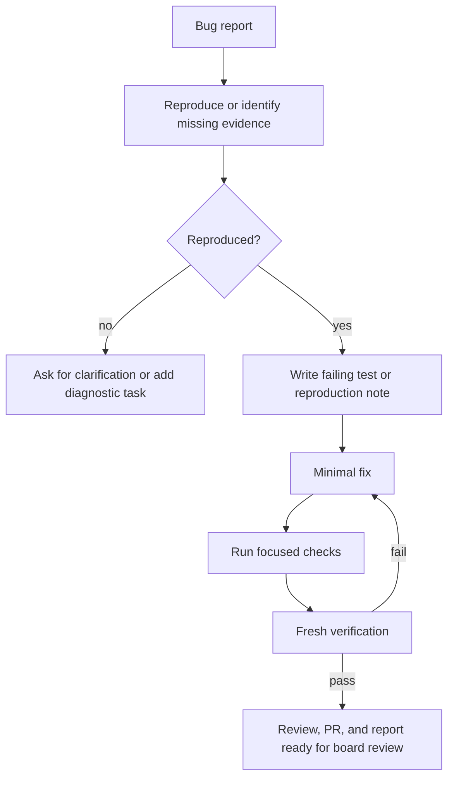

# Workflow: Bugfix

Owner: `Dashboard Engineering Manager`

## Rules

- Use systematic debugging before changing code.
- Do not broaden scope unless the reproduction proves the bug is shared.
- For user-observed UI/data bugs, include the real sanitized case in the spec and verification plan. If the user gives a deal id, screen, filters, expected visual state, or screenshot, the implementation must add either a focused fixture/test for that case or an explicit reason why it cannot.
- The proof must check the symptom the user reported, not only the code path that seemed related. For visual bugs, this means asserting or screenshot-checking the exact UI state the user expected to see.
- If the correct product behavior requires a decision, do not guess. Return the issue to the dashboard/board with a small choice set or a clear question, then wait for the owner comment before implementing that part.
- When returning work to a user for review, include a mini-report: what changed, what the root cause was, how it now behaves, and what was verified.
- Dashboard comment archival is board/user-owned review state. Agents must not archive production dashboard comments automatically after deploy or proof. Archive a production dashboard comment only when the board explicitly asks to archive that exact comment.
- If the bug is data correctness related, pin date range, funnel/category, manager whitelist, stage rules, and SQL/query semantics before changing code.
