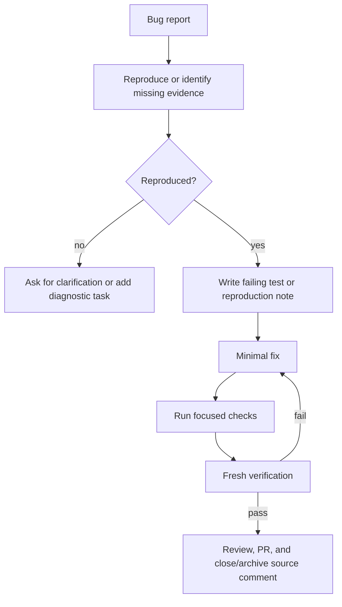

# Workflow: Bugfix

Owner: `Dashboard Engineering Manager`

## Rules

- Use systematic debugging before changing code.
- Do not broaden scope unless the reproduction proves the bug is shared.
- For production comments, archive the source dashboard comment only after the fix is deployed and verified in production.
- If the bug is data correctness related, pin date range, funnel/category, manager whitelist, stage rules, and SQL/query semantics before changing code.
