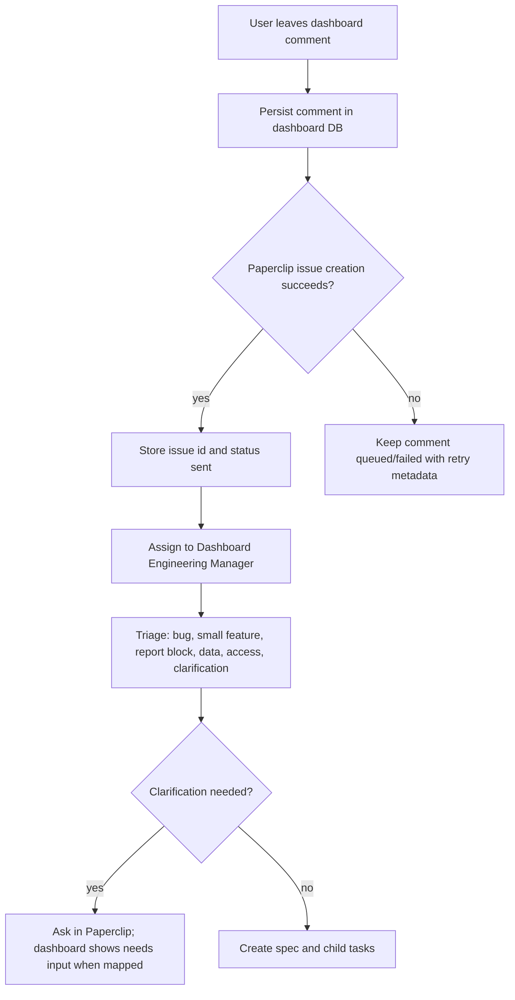

# Workflow: Dashboard Comment To Paperclip Issue

Owner: `Dashboard Intake Service` for issue creation, then `Dashboard Engineering Manager` for triage.

## Goal

Turn a dashboard user comment into a safe, actionable Paperclip issue without exposing personal Bitrix data or implementation secrets.

## Required Issue Context

- module key;
- author login;
- dashboard scene and block anchor;
- selected filters and date range;
- sanitized comment text;
- current dashboard URL/path when safe;
- implementation instructions and privacy constraints.

## Module Isolation

Dashboard comments are module-scoped by default:

- `attraction` comments may change attraction-owned UI, reports, docs, and tests only.
- `leadgen` comments may change leadgen-owned UI, reports, docs, and tests only.
- shared platform code can be changed only when the issue is explicitly marked shared/platform and lists every affected module.
- a leadgen-only issue must not alter attraction scenes, report semantics, manager whitelist, or visual behavior.
- an attraction-only issue must not alter leadgen scenes, category `28` scoping, manager whitelist, or visual behavior.

## Paperclip Project Routing

Dashboard comment issue creation must use the active module's Paperclip mapping:

- `attraction` -> `Attraction Dashboard`
  (`c72f6e08-5483-4e15-8f7d-d33a2c8df4cf`);
- `leadgen` -> `Leadgen Dashboard`
  (`84f6b163-c73a-4e19-8837-a545e9d11ee6`);
- shared/platform tasks may use no module project or a reviewed shared project
  when one exists.

The GitHub repository stays shared. GitHub issues and PRs should carry exactly
one module label: `module:attraction`, `module:leadgen`, or
`module:shared-platform`.

## Banned Payload Data

- deal/contact names;
- phones;
- emails;
- raw Bitrix payloads;
- cookies, tokens, webhooks, SSH details;
- production passwords or session identifiers.

## Status Mapping

- `todo` / `backlog` -> dashboard `sent`
- `in_progress` -> dashboard `in work`
- `blocked` with clarification comment -> dashboard `needs input`
- `done` -> dashboard `done`
- issue creation failure -> dashboard `failed`
- retry pending -> dashboard `queued`
