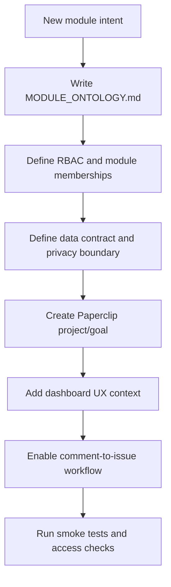

# Workflow: Module Onboarding

Owner: human/Codex for major architecture; Paperclip assists with bounded setup tasks.

## Required Artifacts

- `docs/modules/<module>/MODULE_ONTOLOGY.md`
- data contract and source system notes;
- module role/access matrix;
- dashboard UX/design context;
- Paperclip project and goal ids;
- triage owner id;
- test plan.

## Rule

Do not copy the attraction UI blindly. Modules can diverge when their business workflow requires different screens, density, metrics, controls, or roles.
