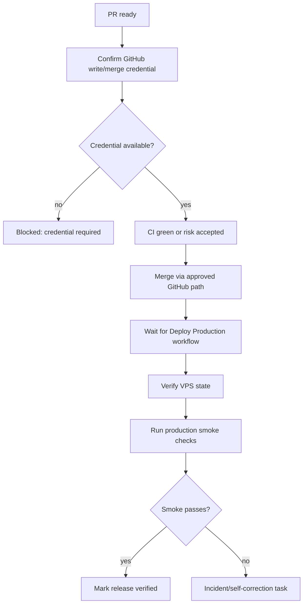

# Workflow: Release And Production Verification

Owner: `Pre-Merge Reviewer` until a dedicated `Release / DevOps Agent` exists.

## Server Rules

- GitHub Actions is the normal production path.
- If GitHub write/merge credentials are unavailable, mark the release task blocked and do not claim merge/deploy completion.
- SSH/root is not part of normal dashboard-comment implementation work.
- Server access is allowed only for explicit release/devops or incident tasks.
- Never print production passwords, session cookies, webhooks, raw tokens, or raw payloads.

## Smoke Checks

- public health endpoint;
- unauthenticated protected endpoint returns `401`;
- authenticated flow with server-side password file only, redacted output;
- direct API port not externally reachable;
- container user is non-root when relevant;
- changed API/UI behavior works in production.

For sync, reporting storage, or module refresh changes, also verify:

- running app revision matches the deployed commit;
- platform, attraction, and leadgen database env values point to distinct SQLite files;
- attraction reporting data is preserved when attraction storage is migrated;
- leadgen manager whitelist count is greater than `0` before claiming leadgen sync is ready;
- module-specific sync endpoint behavior matches the task, without triggering the other live module.
