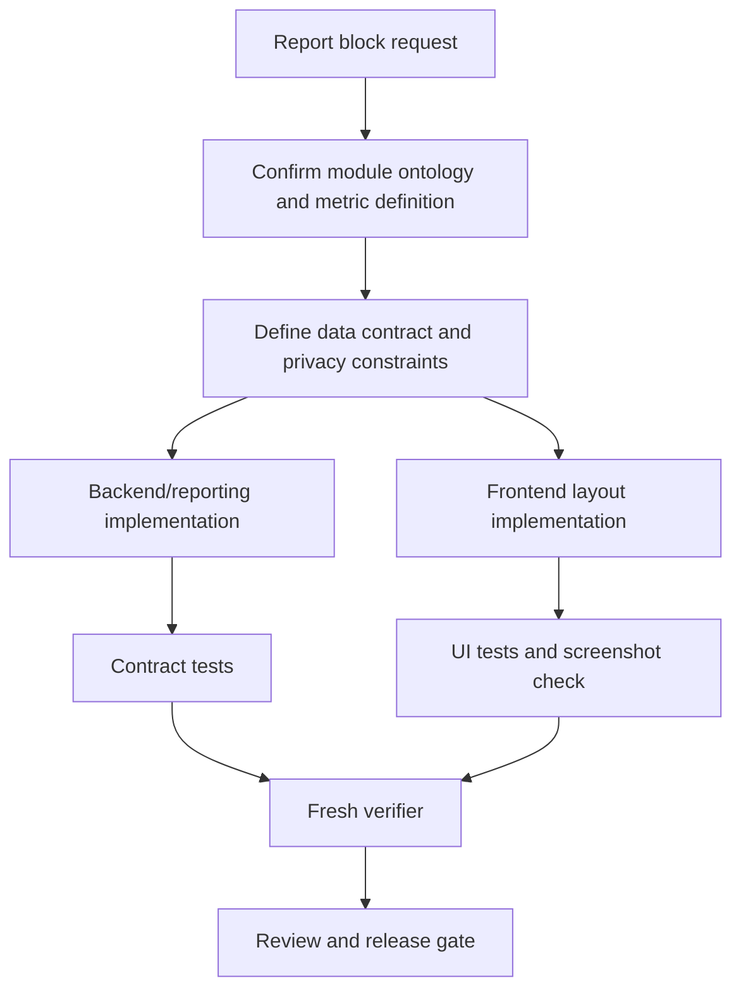

# Workflow: New Report Block

Owner: `Dashboard Engineering Manager`; implementation usually split between `Data/Backend` and `Frontend`.

## Required Spec

- business question answered by the block;
- exact metric definitions;
- source tables/fields;
- period/filter behavior;
- empty/loading/error states;
- privacy constraints;
- acceptance criteria for desktop and mobile.

## Privacy

Report blocks must use aggregate or ID-only data. Do not persist or display deal names, contact names, phones, emails, comments, or raw Bitrix payloads.
