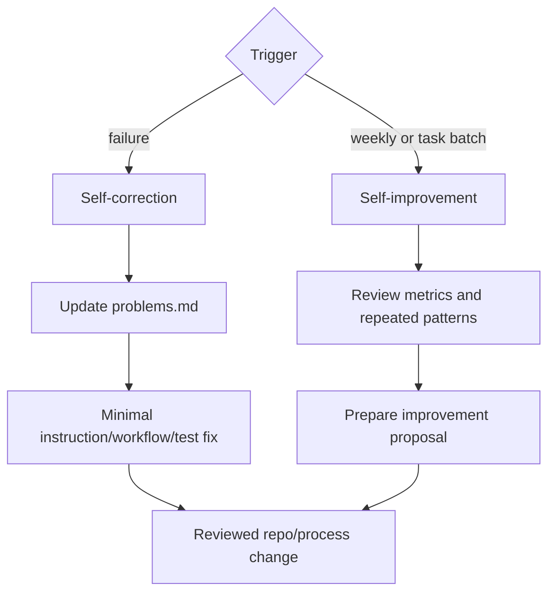

# Workflow: Self-Improvement And Self-Correction

Owner: `Dashboard Engineering Manager` until a dedicated `Agent Operations Manager` exists.

## Self-Correction Triggers

- failed verifier verdict;
- production smoke failure;
- reopened issue;
- privacy/RBAC finding;
- repeated misunderstanding of module ontology;
- missing proof artifacts on a required task.

## Self-Improvement Review

Check:

- proof-loop completeness;
- repeated review findings;
- stale agent instructions;
- missing or unused skills;
- missing MCP servers;
- heartbeat usefulness;
- module ontology gaps;
- agent role overload;
- cost and latency.

## Output

The output is a proposal or PR. Agents must not silently rewrite team rules or add tools/agents without review.
