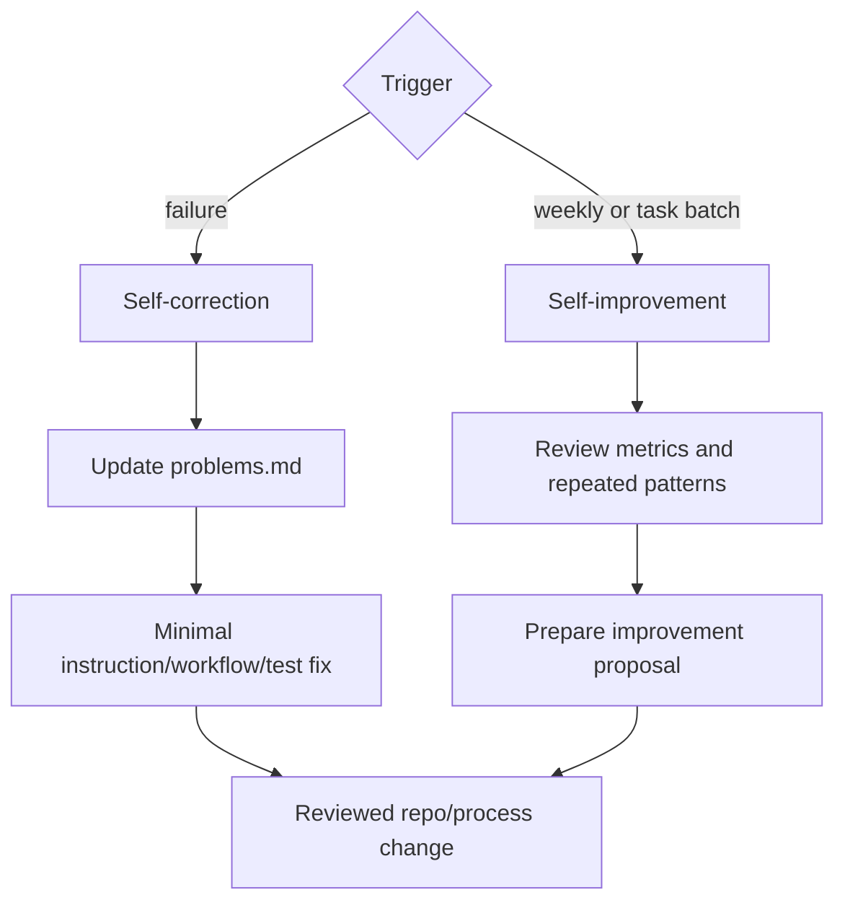

# Workflow: Self-Improvement And Self-Correction

Owner: `Dashboard Engineering Manager` until a dedicated `Agent Operations Manager` exists.



## Self-Correction Triggers

- failed verifier verdict;
- production smoke failure;
- reopened issue;
- privacy/RBAC finding;
- repeated misunderstanding of module ontology;
- missing proof artifacts on a required task.

## Self-Improvement Review

Run this through Paperclip `Routines` that create concrete weekly issues for
the manager. Do not put this work into `HEARTBEAT.md`. The heartbeat is only the
hourly wake checklist; routines are scheduled auditable tasks.

The weekly sequence is:

```text
Еженедельный отчет по качеству команды
  -> Еженедельный аудит инструментов команды
  -> Еженедельное предложение улучшений команды
  -> board approval
  -> normal implementation issues for approved changes
```

The report and proposal must be in Russian. The proposal asks the board to
approve or reject improvements before any instruction, workflow, skill, MCP,
runtime config, test/eval, or team-topology change is applied.

Check:

- proof-loop completeness;
- repeated review findings;
- stale agent instructions;
- missing or unused skills;
- missing MCP servers;
- heartbeat usefulness;
- module ontology gaps;
- agent role overload;
- cost and latency.
- recent trace/tool-call quality;
- false `ready` or unsupported completion claims;
- dashboard status/comment sync gaps;
- user-facing report quality;
- repeated failure classes from `manager-ops-review.md`.

## Output

The output is a report, approval proposal, or implementation issue after
approval. Agents must not silently rewrite team rules, add tools, remove tools,
or change live runtime config without board approval.
