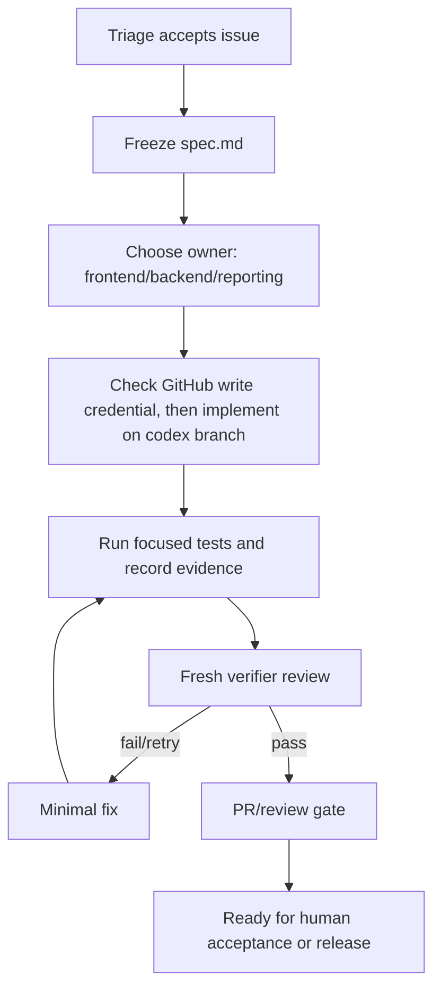

# Workflow: Small Feature

Owner: `Dashboard Engineering Manager`

Use this for small dashboard features, UI improvements, report block additions, and contained backend/API changes.

## Gates

- Spec names module and acceptance criteria.
- If GitHub write/PR credentials are unavailable, stop at patch/evidence handoff, mark the issue blocked, and do not claim PR/merge completion.
- Full proof loop is required when touching shared code, auth, DB, Paperclip, reporting logic, or multi-agent work.
- Reviewer must be a different agent/context from the implementer.
- Dashboard notifications must not expose Paperclip internals unless the product decision changes.

## Default Verification

- API changes: focused API tests.
- Web changes: focused web tests plus browser/screenshot verification when visual behavior changed.
- Shared/RBAC changes: broader suite or explicit residual risk.
